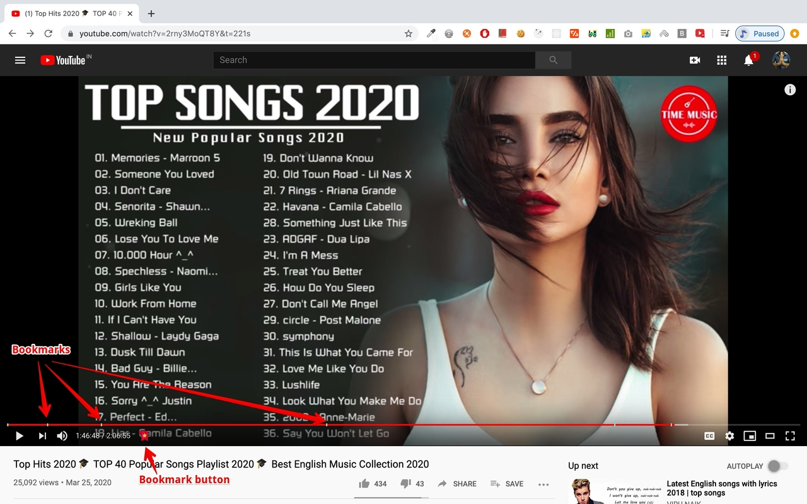
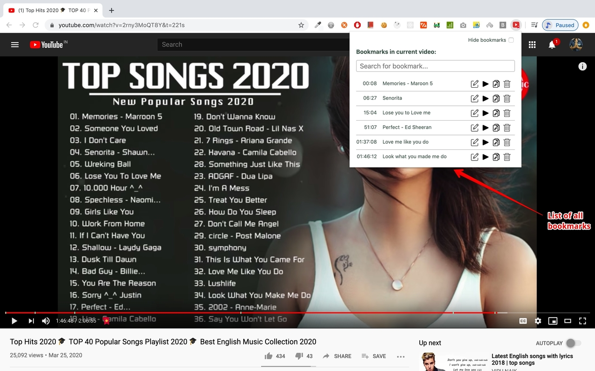

# YouTube-Bookmarker

A Google Chrome extension to add bookmarks to YouTube videos and get easier access to the bookmarks on subsequent access to 
bookmarked videos. User of this extension can edit/add a meaningful description to each bookmark to make the bookmarks legible
and get quicker overview of different points in a YouTube video.

User can also start playback of video from a bookmark, copy and share link of a bookmark to enable playback from that point of
the video and also delete bookmarks if its not needed anymore. All of this from a single extension popup.

### Bookmark button in bottom bar and visual display of all bookmarks

### List of all bookmarks. Accessible from extension popup

### YouTube Bookmarker Extension Demo Video
https://www.youtube.com/watch?v=1ox6oQ-tAbQ
